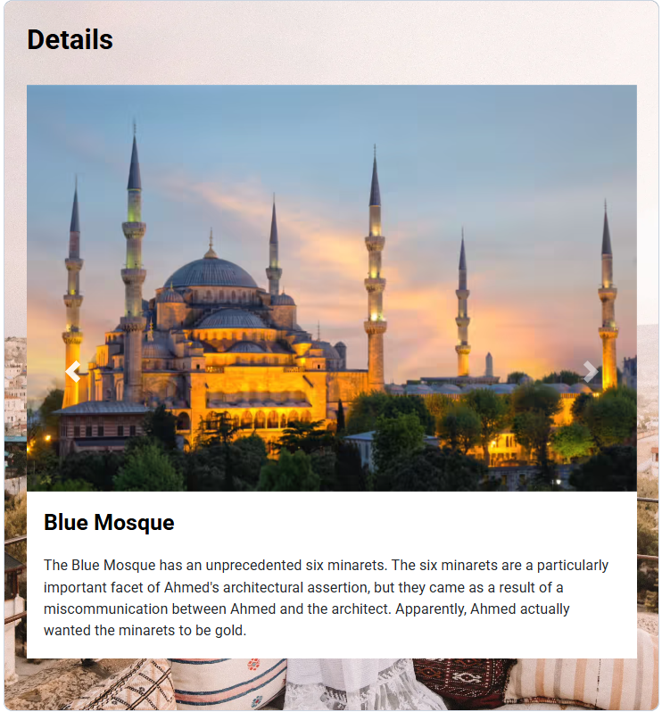

# 🕌 Travel Explorer – Blue Mosque

A responsive destination details page built using **HTML5**, **CSS3**, and **Bootstrap**. The project showcases the **Blue Mosque** with an interactive image carousel and descriptive information, providing an attractive and user-friendly travel experience.

## ✨ Features

- Responsive layout
- Bootstrap image carousel
- Destination information section
- High-quality travel images
- Clean and modern user interface

## 🛠️ Technologies Used

- HTML5
- CSS3
- Bootstrap 4

## 📂 Project Structure

```
Travel-Explorer/
├── index.html
├── style.css
├── screenshots/
│   ├── details-page.png
│   └── carousel.png
└── assets/
```

## 📸 Screenshots

### 🕌 Destination Details



### 🎠 Image Carousel


## 🚀 How to Run

1. Clone or download this repository.
2. Open `index.html` in your preferred web browser.
3. Browse the destination information and explore the image carousel.

## 📚 Skills Demonstrated

- Semantic HTML
- CSS Styling
- Bootstrap Components
- Responsive Web Design
- Bootstrap Carousel
- Layout Design

## 🔮 Future Improvements

- Add multiple travel destinations
- Destination search functionality
- Interactive maps
- Travel itinerary section
- Dark mode support

## 👩‍💻 Author

**Fathimath Shana AP**

- GitHub: https://github.com/shanaap85

---

⭐ Thank you for visiting this project! Feel free to explore my other repositories.
