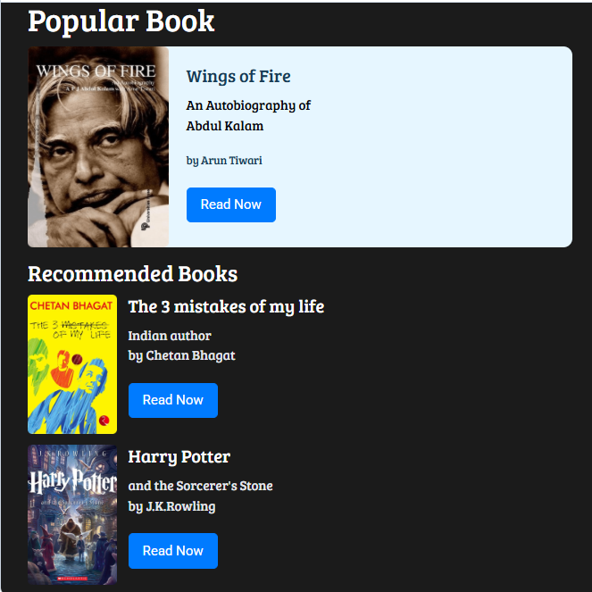

# 📚 Bookstore Page

A responsive bookstore website built using **HTML5**, **CSS3**, and **Bootstrap**. This project provides an attractive interface for exploring books, viewing details, and navigating through different sections of the bookstore.

## ✨ Features

- Responsive and mobile-friendly design
- Book collection display
- Book details page
- Clean and intuitive user interface
- Bootstrap-based layout
- Easy navigation between sections

## 🛠️ Technologies Used

- HTML5
- CSS3
- Bootstrap 4

## 📂 Project Structure

```
Bookstore-Page/
├── index.html
├── style.css
├── screenshots/
│   ├── home.png
│   ├── featured-books.png
│   └── book-details.png
└── assets/
```

## 📸 Screenshots

### 🏠 Home Page



### 📖 Featured Books


### 📚 Book Details


## 🚀 How to Run

1. Clone or download this repository.
2. Open `index.html` in your preferred web browser.
3. Explore the bookstore and browse the available books.

## 📚 Skills Demonstrated

- Semantic HTML
- CSS Styling
- Bootstrap Components
- Responsive Web Design
- Card Layout Design
- Page Navigation

## 🔮 Future Improvements

- Add a search bar for books
- Filter books by category
- Shopping cart functionality
- User login and authentication
- Book reviews and ratings
- Dark mode

## 👩‍💻 Author

**Fathimath Shana AP**

- GitHub: https://github.com/shanaap85

---

⭐ Thank you for visiting this project! Feel free to explore my other repositories and follow my GitHub profile.
