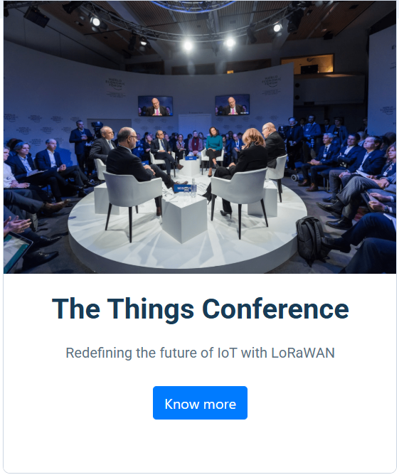
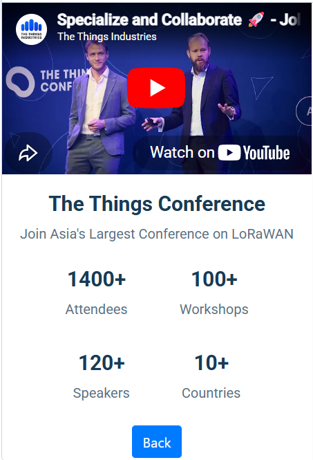
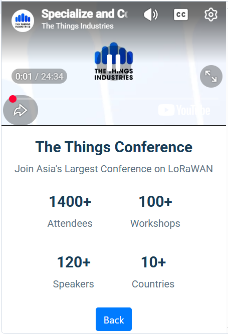

# 🎤 Conference Page

A responsive conference landing page built using **HTML5**, **CSS3**, and **Bootstrap**. The page provides information about a technology conference, including event details, speakers, videos, and registration information.

## ✨ Features

- Responsive user interface
- Conference overview section
- Embedded video support
- Speaker and event information
- Modern card-based layout
- Mobile-friendly design

## 🛠️ Technologies Used

- HTML5
- CSS3
- Bootstrap 4

## 📂 Project Structure

```
Conference-Page/
├── index.html
├── style.css
├── screenshots/
└── assets/
```

## 📸 Screenshots

### Home Page



### Conference Details






## 🚀 How to Run

1. Clone or download the repository.
2. Open `index.html` in your browser.
3. Explore the conference information.

## 📚 Concepts Practiced

- Semantic HTML
- Bootstrap Grid System
- Responsive Design
- Cards and Layout
- Embedded Media

## 🔮 Future Improvements

- Online registration form
- Speaker profiles
- Event schedule
- Countdown timer
- Dark mode

## 👩‍💻 Author

**Fathimath Shana AP**

GitHub: https://github.com/shanaap85
