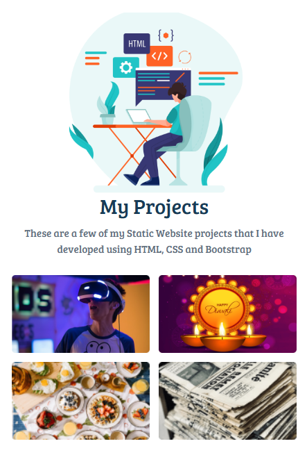

# 📁 My Projects Page

A responsive portfolio webpage built using **HTML5**, **CSS3**, and **Bootstrap**. This project showcases a collection of web development projects in a clean and user-friendly layout.

## ✨ Features

- Responsive design
- Project cards with images
- Clean and modern user interface
- Mobile-friendly layout
- Easy navigation

## 🛠️ Technologies Used

- HTML5
- CSS3
- Bootstrap 4

## 📂 Project Structure

```
My-Projects-Page/
├── index.html
├── style.css
├── screenshots/
│   ├── home.png
│   └── projects.png
└── assets/
```

## 📸 Screenshots

### Home Page



### Advance technology project 


### Diwali project 


## 🚀 How to Run

1. Clone or download this repository.
2. Open `index.html` in your preferred web browser.
3. Explore the projects displayed on the page.

## 📚 Concepts Practiced

- Semantic HTML
- CSS Styling
- Bootstrap Grid System
- Responsive Web Design
- Cards and Layout Design

## 🔮 Future Improvements

- Add JavaScript for interactive features
- Include project filtering by category
- Add dark mode
- Improve animations and hover effects
- Deploy the portfolio using GitHub Pages

## 👩‍💻 Author

**Fathimath Shana AP**

- GitHub: https://github.com/shanaap85

---

⭐ If you found this project interesting, feel free to explore my other repositories.
