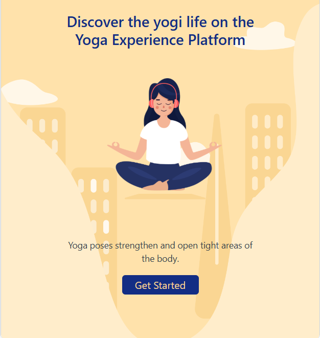
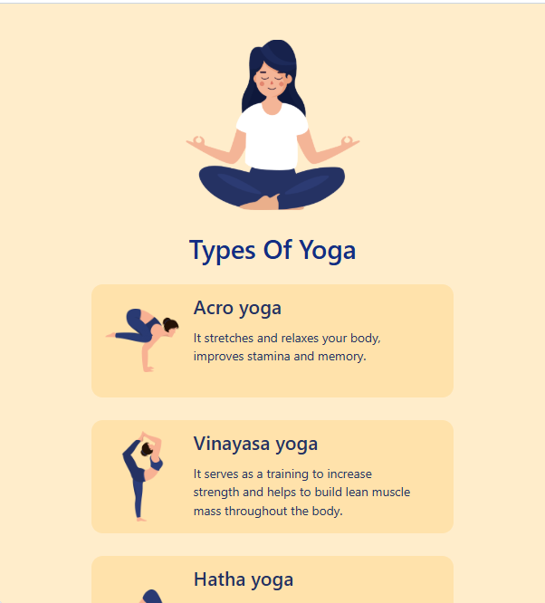

# 🧘 Yoga Page

A responsive wellness landing page built using **HTML5**, **CSS3**, and **Bootstrap**. The website promotes yoga and healthy living through an engaging, mobile-friendly interface with clean layouts and intuitive navigation.

## ✨ Features

- Responsive and mobile-friendly design
- Attractive landing page
- Yoga practice and benefits sections
- Call-to-action buttons
- Clean typography and layout
- Bootstrap-based responsive components

## 🛠️ Technologies Used

- HTML5
- CSS3
- Bootstrap 4

## 📂 Project Structure

```
Yoga-Page/
├── index.html
├── style.css
├── screenshots/
│   ├── home.png
│   ├── benefits.png
│   └── practice.png
└── assets/
```

## 📸 Screenshots

### 🏠 Home Page



### 🌿 Benefits Section




## 🚀 How to Run

1. Clone or download this repository.
2. Open `index.html` in your preferred web browser.
3. Explore the Yoga Page.

## 📚 Skills Demonstrated

- Semantic HTML
- CSS Styling
- Bootstrap Components
- Responsive Web Design
- Flexbox Layout
- UI Design Principles

## 🔮 Future Improvements

- Add yoga session booking
- Dark mode support
- Smooth scrolling animations
- Contact form
- BMI calculator integration
- Personalized yoga recommendations

## 👩‍💻 Author

**Fathimath Shana AP**

- GitHub: https://github.com/shanaap85

---

⭐ Thank you for visiting this project! Feel free to explore my other repositories.
