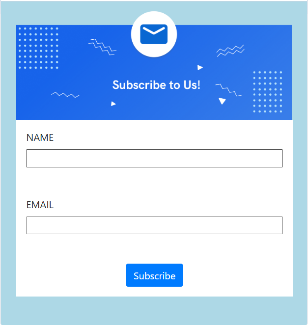
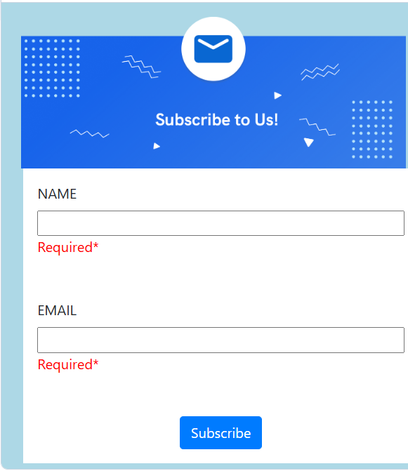

# 📨 Subscription Form Validation

A responsive subscription form built using **HTML5**, **CSS3**, and **JavaScript**. This project validates user input in real time by displaying error messages when required fields are left empty, providing a better user experience.

## ✨ Features

- Responsive user interface
- Real-time form validation
- Required field validation
- Dynamic error messages
- Clean and user-friendly design

## 🛠️ Technologies Used

- HTML5
- CSS3
- JavaScript

## 📂 Project Structure

```
Subscription-Form-Validation/
├── index.html
├── style.css
├── script.js
├── screenshots/
│   ├── home.png
│   └── validation.png
└── README.md
```

## 📸 Screenshots

### 🏠 Form



### ⚠️ Validation Message



## 🚀 How to Run

1. Clone or download this repository.
2. Open `index.html` in your web browser.
3. Leave the input fields empty and click outside the field to see the validation messages.

## 📚 Skills Demonstrated

- DOM Manipulation
- Event Handling
- Form Validation
- Input Validation
- JavaScript Functions
- Responsive Web Design

## 🔮 Future Improvements

- Email format validation
- Password validation
- Success message after submission
- Backend integration
- Regular expression (Regex) validation

## 👩‍💻 Author

**Fathimath Shana AP**

- GitHub: https://github.com/shanaap85

---

⭐ Thank you for visiting this project! Feel free to explore my other repositories.
