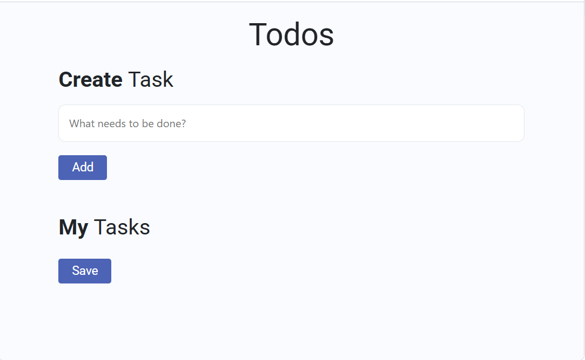
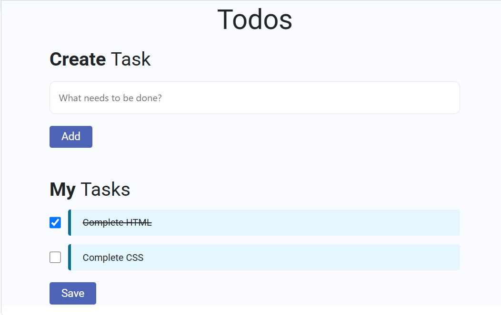

# Todo List

## Overview

A simple task management application that allows users to manage daily tasks.

## Features

- Add tasks
- Delete tasks
- Mark tasks as completed
- Responsive interface

## Technologies Used

- HTML
- CSS
- JavaScript

## Project Structure

```
Todo-List
├── index.html
├── style.css
├── script.js
└── screenshots
```

## Future Improvements

- Local Storage
- Dark Mode
- Task Categories

## Screenshots

### Home Page



### Tasks Added


### Completed Task


