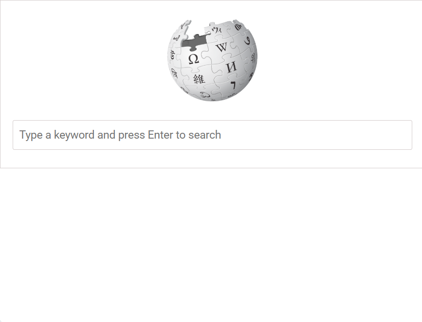

# 🔎 Wikipedia Search

A responsive web application that allows users to search Wikipedia articles using the Wikipedia Search API and view the results instantly.

## ✨ Features

- Search Wikipedia articles
- Real-time search results
- Open articles in a new tab
- Responsive user interface
- Loading indicator while fetching data

## 🛠️ Technologies Used

- HTML5
- CSS3
- JavaScript (ES6)
- REST API
- Fetch API

## 📂 Project Structure

```
Wikipedia-Search/
├── index.html
├── style.css
├── script.js
└── screenshots/
```

## 📸 Screenshots

### Home Page



### Search Results


## 🚀 How to Run

1. Download or clone the repository.
2. Open `index.html` in your browser.
3. Enter a search term.
4. Browse the search results.

## 📚 Concepts Practiced

- DOM Manipulation
- Event Listeners
- Fetch API
- JSON Parsing
- Async JavaScript
- Responsive Web Design

## 🔮 Future Improvements

- Search history
- Voice search
- Dark mode
- Infinite scrolling
- Search suggestions

## 👩‍💻 Author

**Fathimath Shana AP**
