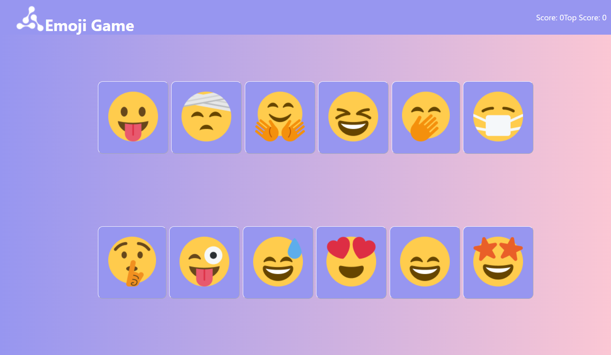
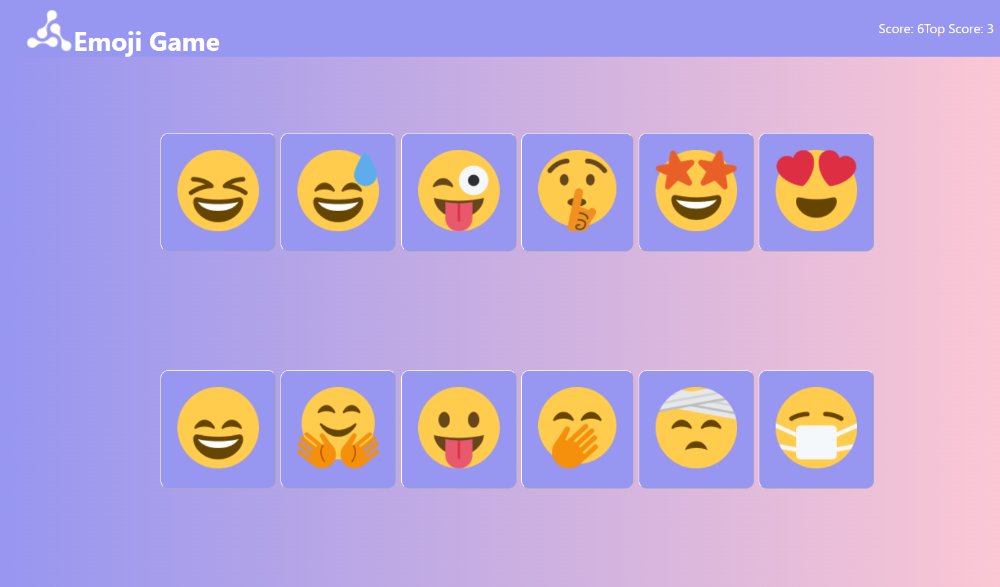
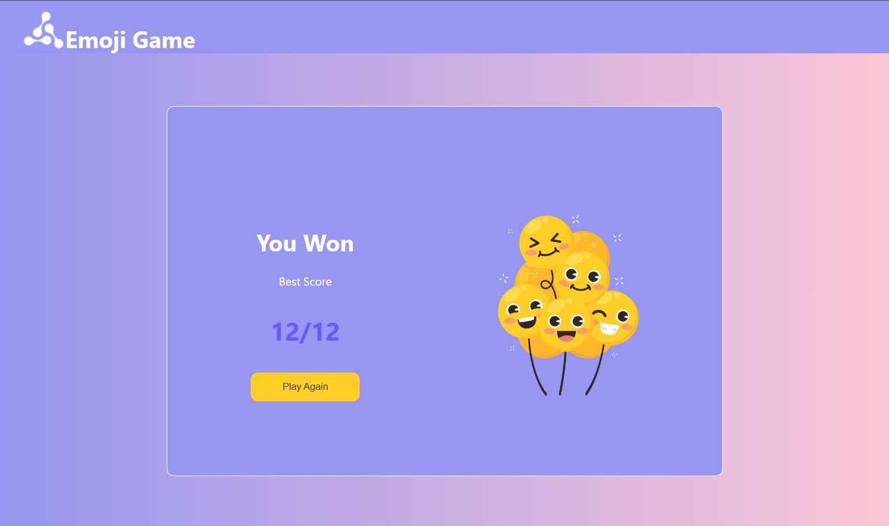

# 🎮 Emoji Game

An interactive memory game built using **React.js** where the objective is to click each emoji only once without repeating any previous selection. The emojis are shuffled after every click, making the game increasingly challenging while testing the player's memory and concentration.

## ✨ Features

- Interactive gameplay
- Randomized emoji order after every click
- Real-time score tracking
- Best score tracking
- Win and lose conditions
- Responsive user interface
- Restart game functionality

## 🛠️ Technologies Used

- React.js
- JavaScript (ES6+)
- HTML5
- CSS3

## 📂 Project Structure

```
Emoji-Game/
├── public/
├── src/
│   ├── components/
│   │   ├── EmojiCard/
│   │   ├── EmojiGame/
│   │   ├── Navbar/
│   │   └── WinOrLoseCard/
│   ├── App.js
│   ├── App.css
│   ├── index.js
│   └── setupTests.js
├── screenshots/
│   ├── home.png
│   ├── gameplay.png
│   ├── game-over.png
│   └── win.png
├── README.md
├── package.json
├── pnpm-lock.yaml
└── .gitignore
```

## 📸 Screenshots

### 🏠 Home Screen



### 🎮 Gameplay



### 💥 Game Over


### 🏆 Winning Screen



## 🎥 Demo Video

Watch the complete gameplay demonstration here:

[▶️ Emoji Game Demo](video/emoji-game-demo.mp4)

## 🚀 Getting Started

### Prerequisites

- Node.js
- npm or pnpm

### Installation

1. Clone the repository

```bash
git clone https://github.com/shanaap85/Emoji-Game.git
```

2. Navigate to the project directory

```bash
cd Emoji-Game
```

3. Install dependencies

Using npm:

```bash
npm install
```

or using pnpm:

```bash
pnpm install
```

4. Start the development server

Using npm:

```bash
npm start
```

or using pnpm:

```bash
pnpm start
```

5. Open your browser and visit:

```
http://localhost:3000
```

## 🎯 How to Play

- Click an emoji to score a point.
- Do not click the same emoji twice.
- The emojis are shuffled after every click.
- The game ends if you select a previously clicked emoji.
- Click all unique emojis to win the game.

## 📚 Skills Demonstrated

- React Components
- Component-Based Architecture
- Props
- State Management
- Event Handling
- Conditional Rendering
- List Rendering
- Array Manipulation
- Random Shuffle Logic
- Responsive UI Design

## 🔮 Future Improvements

- Multiple difficulty levels
- Countdown timer
- Sound effects
- Animations
- Leaderboard
- Dark mode
- Local storage for best score

## 👩‍💻 Author

**Fathimath Shana AP**

- GitHub: https://github.com/shanaap85

---

⭐ If you found this project interesting, feel free to star the repository and explore my other projects!
